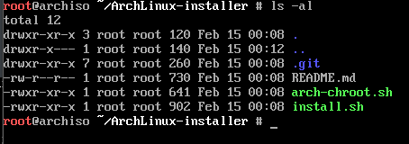

# ArchLinux-installer

ArchLinux installtion script

[中文简体](README_CN.md)

## Note

* You can first try it in a `VirtualMachine`
* Some parameters need to be input during script execution. Please refer to the script prompt for details

## Prerequisites

- A working internet connection
- Logged in as 'root'

## Obtaining The Repository

- Get list of packages and install git: `pacman -Sy git`
- Get the script: `git clone git@github.com:k4jar/ArchLinux-installer.git`

## How to use

Enter the directory


add permission

```shell
chmod +x install.sh arch-chroot.sh
```



```shell
./install.sh
```


```shell
./arch-chroot.sh
```


change password for root

```
passwd
```

exit the Arch

```shell
exit
```

unmount disk partition

```shell
umount /dev/sda1
umount /dev/sda3
```

reboot computer

```shell
reboot
```


## License :scroll:

This project is licenced under the GNU General Public License V3. For more information, see the `LICENSE` file or visit https://www.gnu.org/licenses/gpl-3.0.en.html.