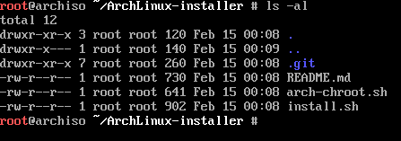
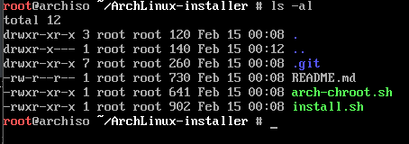
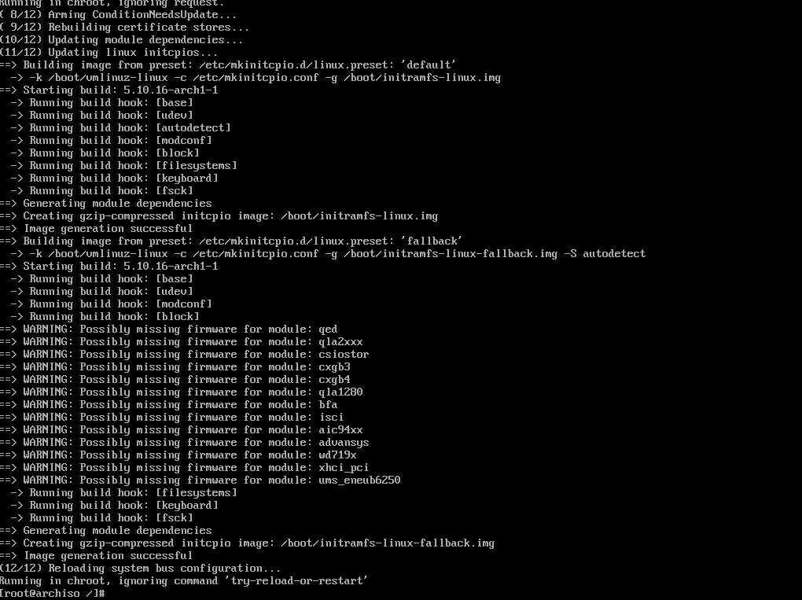
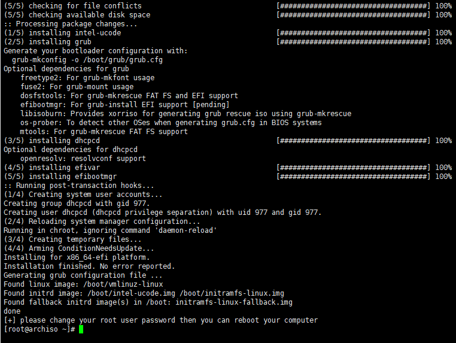

# ArchLinux-installer

ArchLinux安装脚本

[English](README.md)

## 注意

* 你可以先在虚拟机进行尝试

## 前提条件

- A working internet connection
- 登录进root用户
- 已经联网

## 获取脚本

- 安装git: `pacman -Sy git`
- 克隆脚本: `git clone git@github.com:k4jar/ArchLinux-installer.git`

## 怎样使用

进入目录

Enter the directory



添加权限

```shell
chmod +x install.sh arch-chroot.sh
```



```shell
./install.sh
```



```shell
./arch-chroot.sh
```



修改密码

```
passwd
```

退出

```shell
exit
```

卸载分区

```shell
umount /dev/sda1
umount /dev/sda3
```

重启

```shell
reboot
```


## 证书 :scroll:

这个项目是根据GNU通用公共许可证V3授权的。有关详细信息，请参阅“许可证”文件或访问 https://www.gnu.org/licenses/gpl-3.0.en.html.
